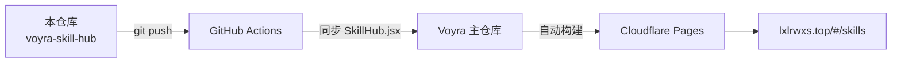

<div align="center">

# 🏆 Voyra · Skill 热榜 · AI Skill Leaderboard

**GitHub 优质 AI Skill 每周热点与星数排行，每日自动刷新 ｜ Trending AI skills on GitHub, ranked by stars, refreshed daily**

[](https://github.com/liixnglinb/voyra-skill-hub/actions/workflows/sync-to-voyra.yml)


### [🌐 在线演示 Live Demo](https://lxlrwxs.top/#/skills) ｜ [🏠 Voyra 主站 Main Site](https://lxlrwxs.top) ｜ [📦 主仓库 Main Repo](https://github.com/liixnglinb/Voyra)

</div>

---

## 💡 这是什么 / What Is This

一个 **100% 基于 GitHub 官方入口**的 AI Skill 发现页：通过 GitHub Search API 实时检索近 7 天更新的 Skill 仓库，按星数排序呈现「每周热点」，并维护「星数排行榜」与「优质精选」，帮你快速跟上 AI Agent / Skill 生态。

*A discovery page built 100% on official GitHub endpoints: it queries the GitHub Search API for skill repositories updated in the last 7 days, ranks them by stars, and curates a leaderboard and a featured list — keeping you up to date with the AI agent/skill ecosystem.*

## ✨ 功能特性 / Features

- **每周热点 Weekly Hot**：检索近 7 天更新的仓库，按星数排序，标注语言与星数。
  *Repos updated within 7 days, ranked by stars with language tags.*
- **星数排行榜 Leaderboard**：收录知名 Skill 仓库，实时拉取最新星数。
  *Tracks well-known skill repos with live star counts.*
- **优质精选 Featured**：人工精选优质项目，一键复制安装命令。
  *Hand-picked repos with one-click copy of install commands.*
- **每日自动刷新**：结果缓存到 localStorage，每天自动更新；手动刷新带 60 秒限流保护。
  *Daily auto-refresh with localStorage cache; manual refresh is rate-limit protected (60s).*
- **官方入口直达**：每个仓库均可一键跳转 GitHub 原始页面，不做二手搬运。
  *Every card links straight to its official GitHub page.*

## 🛠 技术栈 / Tech Stack

| 类别 Category | 技术 Stack |
| --- | --- |
| 框架 Framework | React 18（Hooks） |
| 构建 Build | Vite 5 |
| 样式 Styling | Tailwind CSS |
| 数据源 Data | GitHub Search REST API（fetch） |
| 缓存 Cache | localStorage |
| 图标 Icons | lucide-react |

## 📁 目录结构 / Structure

```
src/
└── pages/
    └── SkillHub.jsx        # 热榜主页面：API 检索/缓存/排行/精选
                            # Main page: API search, cache, ranking, featured
```

> 本模块无后端、无数据库：数据全部来自 GitHub 公开 API，缓存仅存于浏览器本地。
> *No backend or database — data comes entirely from GitHub's public API and is cached locally.*

## 🔗 与 Voyra 主仓库的关系 / How It Syncs

本仓库是 Voyra 个人工具中心「Skill 热榜」模块的**独立源码仓库**：代码在本仓库维护，每次 `push` 由 GitHub Actions 自动同步到 Voyra 主仓库的相同路径，主仓库统一构建并部署到 Cloudflare Pages。

*Standalone source repo of the Skill Leaderboard module. Every push is auto-synced into the main Voyra repository, which builds and deploys the whole site.*



## 🚀 本地开发 / Development

模块依赖主仓库共享层（路由、通用组件），完整运行请克隆主仓库：

*Depends on the main repo's shared layer. Clone the main repo to run locally:*

```bash
git clone https://github.com/liixnglinb/Voyra.git
cd Voyra && npm install && npm run dev
```

> GitHub Search API 未认证请求有频率限制（10 次/分钟），页面已内置缓存与限流提示。
> *Unauthenticated Search API is rate-limited (10 req/min); caching and limit hints are built in.*

## 📄 许可证 / License

MIT © [liixnglinb](https://github.com/liixnglinb)

## 🔍 关键词 / Keywords

Skill热榜 AI Agent Claude Skills GitHub热榜 星数排行 每周热点 AI工具 开源趋势 ｜ ai skill leaderboard agent skills github trending stars ranking weekly hot react
